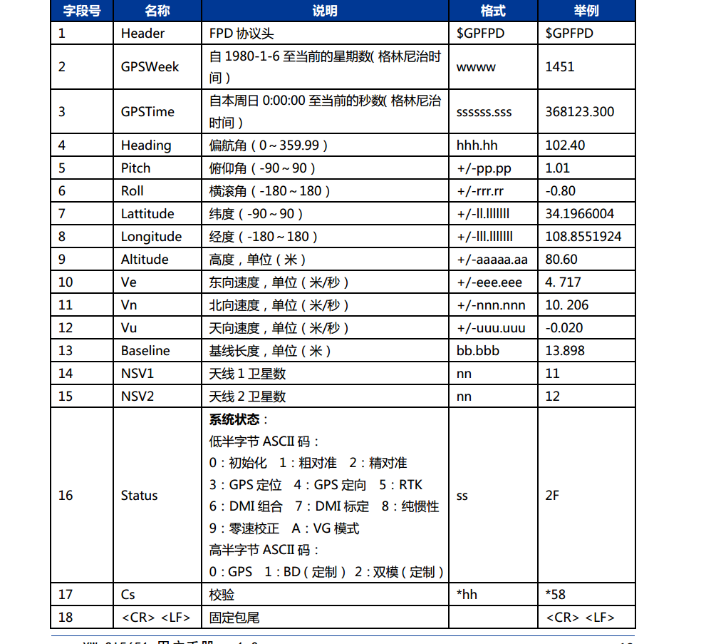

# rs_rtk 使用说明
## 介绍

rs_rtk 是深圳市速腾聚创科技公司开发的rtk ros 驱动程序，使用的是星网宇达公司的GI3668,通过这个驱动程序我们可以获得高精度的RTK信息。

## 更改权限

在运行rs_rtk程序前，请先将usb转串口权限设置最高，例如：

+ 查找gps设备一般为`/dev/ttyUSB*` 或者`/dev/ttyACM*`, `*` 代表数字0~9

+ 使用命令更改权限

```
sudo chmod 777 /dev/tty/USB*
```
或者
```
sudo chmod 777 /dev/ttyACM*

```

## 使用说明

* 运行rs_rtk launch程序，目前有提供2个launch程序

`rs_rtk.launch` 和`rs_rtk_demo.launch`

在`rs_rtk.launch`你可以设置如下参数：
```
<param name="frame" value="gps" />
<param name="topic" value="/gps" />
<param name="port" value="/dev/ttyUSB0" />
<param name="baudrate" value="115200" />
```

使用`rs_rtk_demo.launch`你可以对rtk进行仿真，打开rviz和屏幕，你可以实时看到GPS数据轨迹。

使用带参数的设置，可以获得gps log信息，如下：

```
roslaunch rs_rtk rs_rtk_demo.launch.launch log:=true
```
 log数据将会被保存在`rs_rtk/logs` 文件夹下。

## 输出消息

+ topic: /fix
  message type: sensor_msgs::NavSatFix

+ topic: imu_gpfpd
  message type: sensor_msgs::Imu

  注意:航向角在sensor_msgs::Imu方向，enu速度保存在sensor_msgs::Imu角度速度(单位:m/s)。在RTK的手册中，没有加速度和角速度输出。所以在这种情况下它不能正常使用IMU(在我们的本地化程序中不能替代使用TL740D IMU的IMU)。



