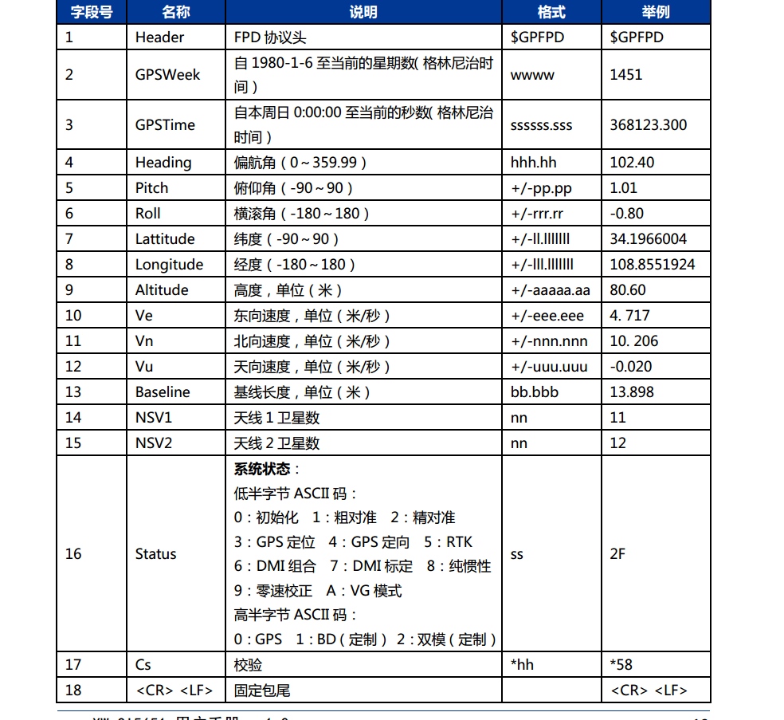

# rs_rtk package for XW_GI3668
## Introduction
rs_rtk is a RTK-GPS driver developed by Robosense which interpretes GPS sentences start with $GPFPD.

## Prepairaton

Before launch this driver, make sure to set up permissions for serial ports first.

+ Check out which device file is representing the gps device(usually it's `/dev/ttyUSB*` or `/dev/ttyACM*`, `*` represents number 0 to 9)

+ Use the following command to set up permissions for the serial port used by the GPS.

```
sudo chmod 777 /dev/tty/USB*
```
or
```
sudo chmod 777 /dev/ttyACM*

```

## Usage
rs_rtk can be launched by `roslaunch`:
```
roslaunch rs_rtk *.launch
```
There are two launch files provided by the package: `rs_rtk.launch` and `rs_rtk_demo.launch`.

In `rs_rtk.launch` you can configure the driver by assigning values to the `value` field in the according `param` tag:
```
<param name="frame" value="gps" />
<param name="topic" value="/fix" />
<param name="port" value="/dev/ttyUSB0" />
<param name="baudrate" value="115200" />
```

Use `rs_rtk_demo.launch` if you want to debug this package. Some debug messages will be printed out to the screen and `rviz` will be launched to visualize the GPS data.

Besides the parameter mentioned above, you can choose to log data by passing a argument to the launch file:

```
roslaunch rs_rtk rs_rtk_demo.launch.launch log:=true
```
The log file will be saved under the `rs_rtk/logs` directory.

## Output message

+ topic: /fix
message type: sensor_msgs::NavSatFix

+ topic: imu_gpfpd
message type: sensor_msgs::Imu

Note: the heading angle is in the sensor_msgs::Imu orientation, and the velocity in enu save int the sensor_msgs::Imu angular_velocity (unit: m/s). other msg in imu_gpfpd is useless. In the manual of the RTK, there is no acceleration and angular velocity output. So in this case it can't be used as normal IMU (can't replace the IMU use TL740D IMU in our localization program ).



